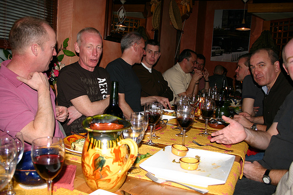
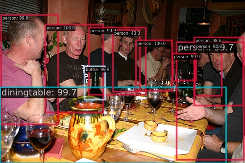

# VOC mmdetection

神经网络和深度学习（DATA620004）期中作业，任务2.

## 要求
在VOC数据集上训练并测试目标检测模型**Faster R-CNN**和**YOLO V3**

- 学习使用现成的目标检测框架——如mmdetection或detectron2——在VOC数据集上训练并测试目标检测模型Faster R-CNN和YOLO V3；
- 挑选4张测试集中的图像，通过可视化对比训练好的Faster R-CNN第一阶段产生的proposal box和最终的预测结果。
- 搜集三张不在VOC数据集内包含有VOC中类别物体的图像，分别可视化并比较两个在VOC数据集上训练好的模型在这三张图片上的检测结果（展示bounding box、类别标签和得分）；

## 环境搭建
我们将使用`mmdetection`来完成这个任务。

首先需要安装`pytorch`，由于`mmdetection`的兼容性，需要安装`cuda 11.7`版本对应的`torch 2.0.1`：

```bash
pip3 install torch torchvision torchaudio --index-url https://download.pytorch.org/whl/cu117
```
> FYI，在Windows上可以同时安装多个版本的cuda，只要指定环境变量`CUDA_PATH`即可修改默认的cuda。


然后我们安装`openmim`，用它来安装`mmdetection`：
```bash
pip3 install -U openmim
mim install mmengine
mim install "mmcv==2.1.0"
mim install mmdet
```

## 数据集
我们使用的是VOC2012数据集。
> VOC2012这个挑战的目标是从现实场景中的许多视觉对象类别中识别对象（即不是预先分割的对象）。它基本上是一个监督学习问题，因为它提供了一组标记图像的训练集。已选择的 20 个对象类别是： 人：人 动物：鸟、猫、牛、狗、马、羊 交通工具：飞机、自行车、船、公共汽车、汽车、摩托车、火车 室内：瓶子、椅子、餐桌、盆栽、沙发、电视/显示器 将有两个主要比赛和两个较小规模的“品尝者”比赛。内容：提供的训练数据由一组图像组成；每个图像都有一个注释文件，为图像中存在的 20 个类别之一中的每个对象提供一个边界框和对象类别标签。请注意，来自多个类的多个对象可能出现在同一图像中。

### 下载
```bash
python tools/misc/download_dataset.py --dataset-name voc2012
```

### 组织
数据下载完之后，解压到data文件夹得到如下的结构：
```
data
└─coco
    └─VOCtrainval_11-May-2012
        └─VOCdevkit
            └─VOC2012
                ├─Annotations
                ├─ImageSets
                │  ├─Action
                │  ├─Layout
                │  ├─Main
                │  └─Segmentation
                ├─JPEGImages
                ├─SegmentationClass
                └─SegmentationObject
```
该数据集共计17125个图像。
### 划分
我们使用：
```
data/coco/VOCtrainval_11-May-2012/VOCdevkit/VOC2012/ImageSets/Main/train.txt
```
（共计5717个图像）作为训练集。

使用：
```
data/coco/VOCtrainval_11-May-2012/VOCdevkit/VOC2012/ImageSets/Main/val.txt
```
（共计5717个图像）作为测试集。
## 模型训练
使用mmdetection提供的脚本：
### Faster R-CNN

正常训练：
```bash
python tools/train.py configs/faster_rcnn/faster-rcnn_r50_fpn_1x_voc.py
```

从断点继续训练：
```bash
python tools/train.py configs/faster_rcnn/faster-rcnn_r50_fpn_1x_voc.py --resume [checkpoint.pth]
```

### YOLO V3
正常训练：
```bash
python tools/train.py configs/yolo/yolov3_d53_8xb8-ms-608-273e_voc_base.py
```

从断点继续训练：
```bash
python tools/train.py configs/yolo/yolov3_d53_8xb8-ms-608-273e_voc_base.py --resume [checkpoint.pth]
```

训练完的日志和权重保存在work_dirs文件夹。

## 模型测试
使用mmdetection提供的脚本：
### Faster R-CNN
```bash
python tools/test.py configs/faster_rcnn/faster-rcnn_r50_fpn_1x_voc.py work_dirs/faster-rcnn_r50_fpn_1x_voc/epoch_10.pth
```
### YOLO V3
```bash
python tools/test.py configs/yolo/yolov3_d53_8xb8-ms-608-273e_voc_base.py work_dirs/yolov3_d53_8xb8-ms-608-273e_voc_base/epoch_100.pth
```

## 模型推理

```bash
python inference.py
```
一例：

- 原图：
    - 
- 可视化bounding box：
    - 
- 模型输出：
```json
{
    "labels": [
        14,
        14,
        14,
        14,
        14,
        4,
        10,
        14,
        14,
        14,
        14,
        10,
        10,
        14,
        14,
        14,
        14
    ],
    "scores": [
        0.999847412109375,
        0.9996101260185242,
        0.9994789958000183,
        0.9994264841079712,
        0.9992637038230896,
        0.9985488057136536,
        0.9970762729644775,
        0.9967821836471558,
        0.9861702919006348,
        0.9489360451698303,
        0.4332524836063385,
        0.22431445121765137,
        0.17479072511196136,
        0.16827289760112762,
        0.13223162293434143,
        0.11941542476415634,
        0.059175413101911545
    ],
    "bboxes": [
        [
            91.67660522460938,
            50.48377990722656,
            209.81333923339844,
            228.71080017089844
        ],
        [
            276.7741394042969,
            81.86434936523438,
            350.6646423339844,
            185.0067596435547
        ],
        [
            1.5342577695846558,
            29.54728126525879,
            118.23262023925781,
            253.7919464111328
        ],
        [
            181.2398681640625,
            56.38529586791992,
            297.0572204589844,
            193.12933349609375
        ],
        [
            351.87835693359375,
            109.37857055664062,
            399.53753662109375,
            163.8385467529297
        ],
        [
            172.13270568847656,
            134.6718292236328,
            214.30738830566406,
            203.38827514648438
        ],
        [
            0.3956954777240753,
            178.3833770751953,
            461.24554443359375,
            333.0
        ],
        [
            360.0343322753906,
            86.17256164550781,
            496.6365051269531,
            326.0494079589844
        ],
        [
            396.4289245605469,
            76.16590881347656,
            495.6755065917969,
            215.24337768554688
        ],
        [
            397.35540771484375,
            87.5771713256836,
            452.4204406738281,
            194.97833251953125
        ],
        [
            229.8292694091797,
            61.49006271362305,
            285.28558349609375,
            186.58828735351562
        ],
        [
            230.75759887695312,
            186.09835815429688,
            412.2704772949219,
            333.0
        ],
        [
            0.0,
            218.197998046875,
            277.2224426269531,
            333.0
        ],
        [
            73.6247329711914,
            61.248268127441406,
            306.6939392089844,
            203.2276153564453
        ],
        [
            142.47677612304688,
            56.185577392578125,
            259.0111999511719,
            208.97982788085938
        ],
        [
            49.905826568603516,
            37.84497833251953,
            169.13919067382812,
            247.78897094726562
        ],
        [
            353.74969482421875,
            96.02874755859375,
            474.7113952636719,
            240.64328002929688
        ]
    ]
}
```